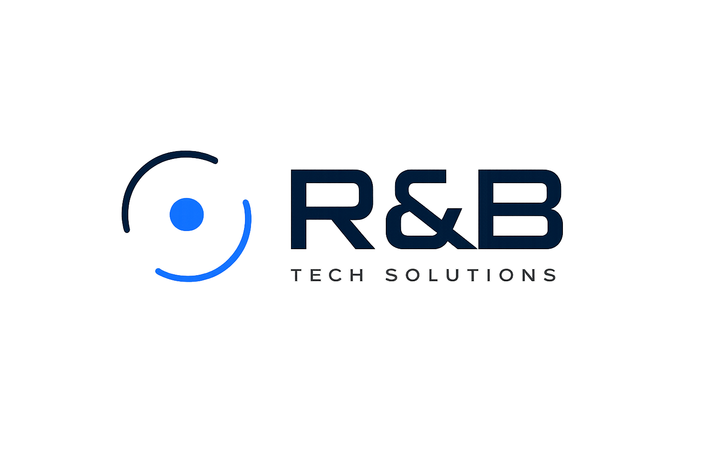

# R&B Tech Solutions — Landing Page

Landing page profesional y responsiva para **R&B Tech Solutions**, una empresa de software.
Construida con HTML, CSS y **GSAP + ScrollTrigger** para animaciones modernas.



## ✨ Características

- Diseño responsivo (escritorio, tablet y móvil)
- Animaciones profesionales con **GSAP** (entrada del hero, isotipo de doble órbita en movimiento, parallax, reveals por scroll, botones magnéticos, marquee infinito)
- Branding oficial: Navy `#001A33`, Azul Innovación `#0066FF`, tipografía Montserrat + Roboto
- Botón flotante de **WhatsApp** (+595 971 577560)
- Formulario de contacto que envía a `rbtechsolutionspy@gmail.com`
- Accesibilidad: respeta `prefers-reduced-motion`

## 📁 Estructura

```
.
├── index.html        # Marcado de la página
├── css/styles.css    # Estilos y diseño responsivo
├── js/main.js        # Animaciones GSAP + lógica
└── assets/           # Logo y manual de branding
```

## 🚀 Desarrollo local

Es un sitio **100% estático**, no requiere build. Para verlo localmente:

```bash
# con Python
python -m http.server 5500
# luego abre http://localhost:5500
```

## ☁️ Despliegue

No necesita configuración de build. Es un sitio estático servido desde la raíz.

### Vercel
1. Importa el repositorio en [vercel.com/new](https://vercel.com/new).
2. **Framework Preset:** `Other`.
3. **Build Command:** *(vacío)* · **Output Directory:** `./` (raíz).
4. Deploy.

### Cloudflare Pages
1. En el dashboard de Cloudflare → **Workers & Pages** → **Create** → **Pages** → conecta el repo.
2. **Build command:** *(vacío)* · **Build output directory:** `/` (raíz).
3. Save and Deploy.

### GitHub Pages
1. Settings → Pages → Source: `Deploy from a branch` → `main` / `root`.

---

© R&B Tech Solutions
